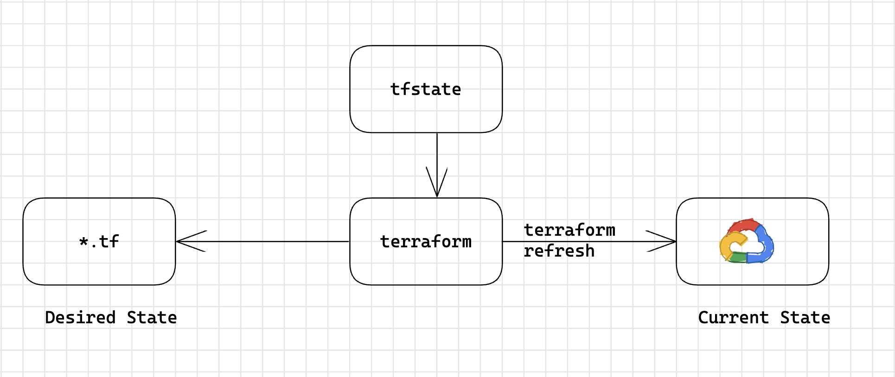

## Statefile


<br/>
<br/>

### Option 1: local backend

### Option 2: Hardcode bucket name and prefix in terraform block
```
terraform {
  backend "gcs" {
    bucket  = "<terraform-backend-bucket-name>"
    prefix  = "terraform/state"
  }
}
```

### Option 3: Provide bucket and prefix from file
```
terraform {
  backend "gcs" {
  }
}
```

Create a file `backend/dev.tfvars` to seperate the backend for different environment with following content
```
```
bucket  = "<terraform-backend-bucket-name>"
prefix  = "terraform/state"
```

### Option 4: Provide bucket and prefix from command line

```
terraform {
  backend "gcs" {
  }
}
```

```
terraform init -backend-config bucket="<terraform-backend-bucket-name>" -backend-config prefix="terraform/newstate"
```

Note that the backend bucket should be valid existing bucket, the prefix will be created automatically if not available.