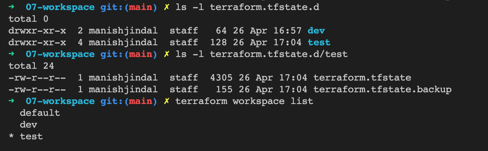

## Workspace

Terraform allows us to have multiple workspaces, with each of the workspace we can have different set of environment variables associated.

Terraform keeps the workspace separate by created different folders for each workspace in the backend bucket or locally in  `terraform.tfstate.d` directory.

you can use `terraform.workspace` variable inside the tf files to get the workspace name.

Create and switch to workspace
```
terraform workspace new test
```

List Workspace
```
terraform workspace list
  default
  dev
* test
```


<br/>
<br/>


List Workspace
```
terraform workspace list
  default
  dev
* test
```
