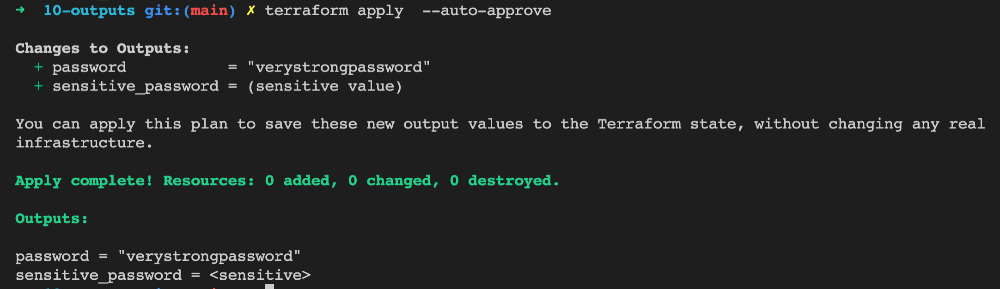
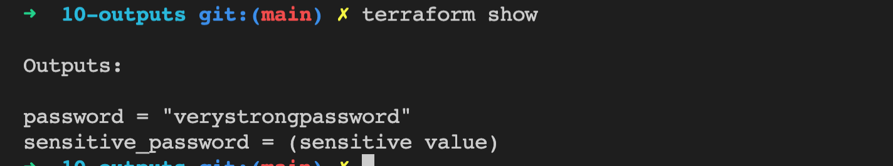
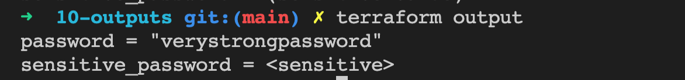
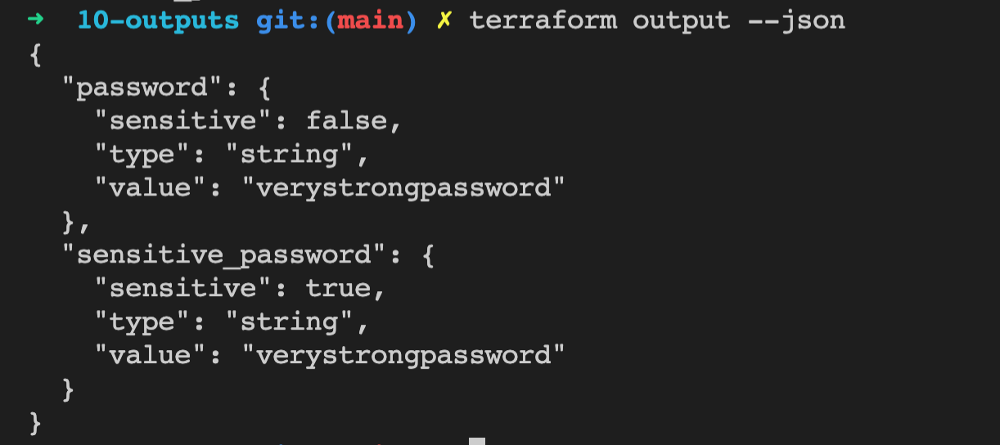

## Outputs

With organization managing their entire infrastructure in terraform, it is likely that you will see some sensitive information embedded in the code.
When working with a field that contains information likely to be considered sensitive, it is best to set the Sensitive property on its schema to true

 
 

View the statefile content using `terraform show` command.

 
 

View the terraform output using `terraform output` command

 
 

In both the cases the output is sensitive but you can still see the output value using `terraform output --json`

 
 